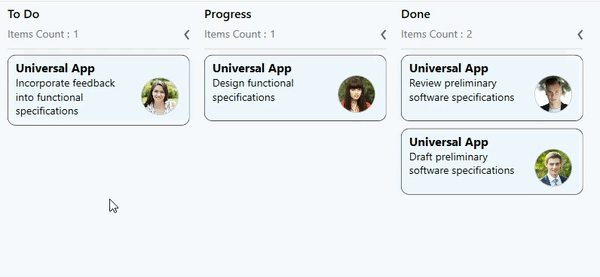

# How-to-show-the-tooltip-on-WPF-Kanban-cards
This article explains how to show the tooltip on [Syncfusion WPF SfKanban control](https://help.syncfusion.com/wpf/kanban-board/getting-started) cards as show in below.

 

This has been achieved by adding the tooltip supported control as base and add your desired view into  the [CardTemplate](https://help.syncfusion.com/cr/wpf/Syncfusion.UI.Xaml.Kanban.SfKanban.html#Syncfusion_UI_Xaml_Kanban_SfKanban_CardTemplate) property of Kanban as shown in below

[XAML]

*Border control by default has tooltip support, hence add that as template view of cards. Here just show its ID value in tooltip.*
```
<syncfusion:SfKanban 
            MinColumnWidth="150" 
            ColumnMappingPath="Category" 
            ItemsSource="{Binding Tasks}"
            AutoGenerateColumns="False">

            <syncfusion:KanbanColumn Categories="Open" Title="To Do"/>
            <syncfusion:KanbanColumn Categories="In Progress" Title="Progress"/>
            <syncfusion:KanbanColumn Categories="Review,Done" Title="Done"/>
            
            <syncfusion:SfKanban.CardTemplate>
                <DataTemplate>
                    <!--Tooltip supported control has been added as base-->
                    <Border BorderBrush="Black"  BorderThickness="0.75"  CornerRadius="10" Background="AliceBlue" Margin="0,5,0,5">
                        <Border.ToolTip>
                            <TextBlock FontSize="20" HorizontalAlignment="Stretch"  Text="{Binding ID}"/>
                        </Border.ToolTip>
                        <Grid Margin="10,5,5,10">
                            <Grid.ColumnDefinitions>
                                <ColumnDefinition Width="7*" />
                                <ColumnDefinition Width="3*" />
                            </Grid.ColumnDefinitions>
                            <Grid.RowDefinitions>
                                <RowDefinition Height="Auto" />
                                <RowDefinition Height="Auto" />
                            </Grid.RowDefinitions>
                            <TextBlock Text="{Binding Path=Title}"  FontWeight="Bold"  FontSize="16" />
                            <TextBlock Grid.Row="1"   FontSize="14"  HorizontalAlignment="Left"  Text="{Binding Description}"  TextWrapping="Wrap"/>
                            <Border Grid.Row="1"   Grid.Column="1"  Height="50"  CornerRadius="50"   Width="50" BorderBrush="Silver" BorderThickness=".75">
                                <Border.Background>
                                    <ImageBrush ImageSource="{Binding ImageURL}" />
                                </Border.Background>
                            </Border>
                        </Grid>
                    </Border>
                </DataTemplate>
            </syncfusion:SfKanban.CardTemplate>   
     </syncfusion:SfKanban>
```
**CardTemplate has DataContext as [KanbanModel](https://help.syncfusion.com/cr/wpf/Syncfusion.UI.Xaml.Kanban.KanbanModel.html)**

# See also

[How to add the template to the WPF SfKanban cards](https://help.syncfusion.com/wpf/kanban-board/cards#template)

[How to placeholder in WPF SfKanban](https://help.syncfusion.com/wpf/kanban-board/placeholderstyle)

[How to customize the column in WPF SfKanban](https://help.syncfusion.com/wpf/kanban-board/column)


